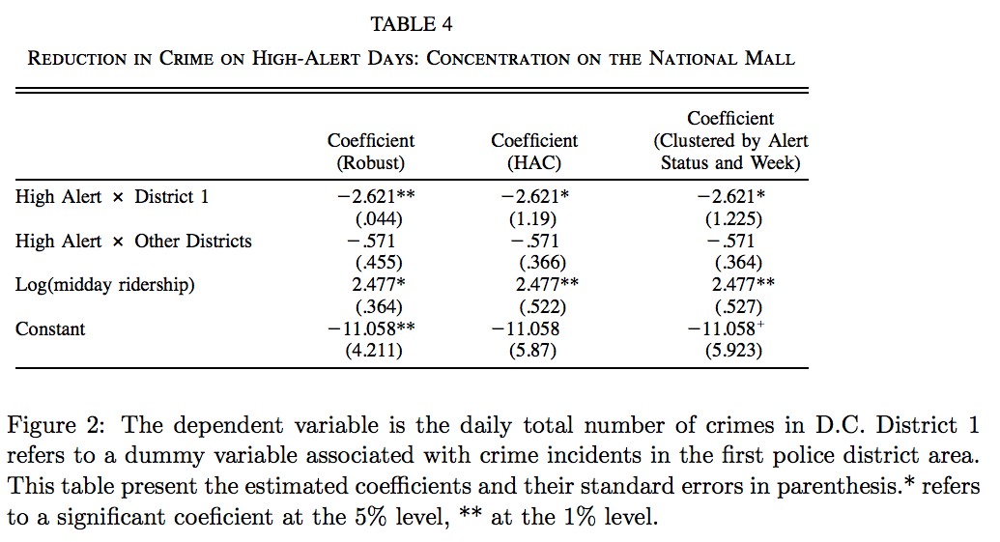

```{r setup, include=FALSE, comment=NA}
library(ggplot2)
library(LICORS)  # for kmeans++
library(foreach)
library(mosaic)
library(cluster)
library(tidyverse)
library(FNN)
library(glmnet)

set.seed(1)

knitr::opts_chunk$set(echo = TRUE, cache = TRUE)

green = read.csv('./data/greenbuildings.csv')
wine = read.csv('./data/wine.csv')
social = read.csv('./data/social_marketing.csv')
```

# Predictive model building

## Overview

In this activity, we attempt to identify the best possible model to predict rent prices for a collection of 7,894 rental properties across the United States. In addition, we want to quantify the average change in rental income per square foot associated with green certification, while holding other factors constant. To do this, we will explore a variety of different models in order to build the best predictor of price and measure their accuracies. Analyzing the nature of this best price prediction model will allow us to determine the average change in rental income associated with green certification.

## Data and Model

Of the 7,894 properties in the dataset, 685 properties have been awarded either LEED or EnergyStar certification as a green building. The dataset includes 22 features associated with each rental property such as size, rent, age, etc. Rent is the feature of interest in this activity as we attempt to build the best model to predict the rental price.

In order to test which model would be best for this activity, we built 5 different models: two linear models, a KNN regression model, a lasso regression and ridge regression model, and finally two logistic regression models. By including a variety of prediction models, we can ensure that we will have the most accurate model to describe price. We measured the performance of every model using RMSE (root mean squared error) to determine which had the least error with smaller RMSE values indicating higher accuracy. In order to reduce Monte Carlo variability, we used 200 repeated random samples of the data for each model to find the true RMSE values.

\dotfill

### Linear Model

The first model we built were two basic linear models. The first model included all of the features without interactions and the second model included all of the features with interactions. Even though lasso and ridge regression are improved versions of the linear model, we included these linear models as a benchmark. As the models involve multiple x-values, we decided to plot the actual price vs predicted price, and include a y=x line as a benchmark of what perfect fit would look like. 

```{r green_lm, include=FALSE, comment=NA}
# rmse function
rmse = function(y, yhat) {
  sqrt(mean((y - yhat)^2, na.rm=TRUE))
}

# variables that control how long the program takes to run
num_splits = 200
k_limit = 50

#model 1: linear regression model (RMSE)
#80% training data, 20% test data
n = nrow(green)
n_train = round(0.8*n)  # round to nearest integer
n_test = n - n_train

#200 different random splits
lm_vals = do(num_splits)*{
  
  # re-split into train and test cases with the same sample sizes
  train_cases = sample.int(n, n_train, replace=FALSE)
  test_cases = setdiff(1:n, train_cases)
  on_train = green[train_cases, 2:ncol(green)]
  on_test = green[test_cases, 2:ncol(green)]
  
  lm_ajjarapu = lm(Rent ~ ., data=on_train)
  lm_ajjarapu_2 = lm(Rent ~ .^2, data=on_train)
  
  # Predictions out of sample + convert to binary
  y_test = predict(lm_ajjarapu, on_test)
  y_test_2 = predict(lm_ajjarapu_2, on_test)
  
  c(rmse(y_test, on_test$Rent),rmse(y_test_2, on_test$Rent))
}
lm_avg = unname(colMeans(lm_vals))
```

```{r green_lm_rmse, echo=FALSE, comment=NA}
cat("LINEAR REGRESSION MODEL (without interactions) - RMSE:", lm_avg[1])
cat("\nLINEAR REGRESSION MODEL (with interactions) - RMSE:", lm_avg[2])
```

```{r green_lm_plot1, echo=FALSE, comment=NA}
train_cases = sample.int(n, n_train, replace=FALSE)
test_cases = setdiff(1:n, train_cases)
on_train = green[train_cases, 2:ncol(green)]
on_test = green[test_cases, 2:ncol(green)]

#without interactions
lm_ajjarapu = lm(Rent ~ ., data=on_train)

# Predictions out of sample + convert to binary
y_test = predict(lm_ajjarapu, on_test)

ggplot() +
  geom_point(data=on_test,aes(x = Rent, y = y_test ), color="black") + 
  geom_line(data=on_test,aes(x = Rent, y = Rent ), color="red") + 
  xlab("actual price") + 
  ylab("predicted price") + 
  ggtitle("Actual Price vs Predicted Price for Linear Model without Interactions")

```

```{r green_lm_plot2, echo=FALSE, comment=NA}
#with interactions
lm_ajjarapu_2 = lm(Rent ~ .^2, data=on_train)
y_test_2 = predict(lm_ajjarapu_2, on_test)
ggplot() +
  geom_point(data=on_test,aes(x = Rent, y = y_test_2 ), color="black") + 
  geom_line(data=on_test,aes(x = Rent, y = Rent ), color="red") + 
  xlab("actual price") + 
  ylab("predicted price") + 
  ggtitle("Actual Price vs Predicted Price for Linear Model with Interactions")


```

\dotfill

### KNN Model

The second model we built was a KNN model. In order to identify the optimal value of $k$, we tested $k$ values from 2 - 50. From the RMSE plot below, we can see that the optimal value of $k$ is 46 because it has the lowest RMSE value (~15.03).

```{r green_knn, include=FALSE, comment=NA}
k_vals = 2:k_limit
knn_vals = matrix(0, k_limit - 1, 2)

for (k_val in 3) {
  rmse_vals_iter = do(2)*{
    
    # re-split into train and test cases with the same sample sizes
    train_cases = sample.int(n, n_train, replace=FALSE)
    test_cases = setdiff(1:n, train_cases)
    on_train = green[train_cases,2:ncol(green)]
    on_test = green[test_cases,2:ncol(green)]

    #create KNN model
    Xtrain_temp = model.matrix(Rent ~ . - 1, data = on_train)
    Xtest_temp = model.matrix(Rent ~ . - 1, data = on_test)
    
    ytrain = on_train$Rent
    ytest = on_test$Rent
    
    #standardize data
    scale_amount = apply(Xtrain_temp, 2, sd)
    Xtrain = scale(Xtrain_temp, scale=scale_amount)
    Xtest = scale(Xtest_temp, scale=scale_amount)
    
    #train k model
    knn_model = knn.reg(Xtrain, Xtest, ytrain, k=k_val)
    
    # Predictions out of sample + convert to binary
    yhat_test1_pred = knn_model$pred
    
    #NOTE: RMSE might return error b/c of NAs in Xtrain_temp and Xtest_temp, look at fix in glmnet model   where I use na.pass and complete.cases() to remove any NAs in the start
    c(k_val,rmse(yhat_test1_pred, ytest))
  }
  rmse_vals_avg = colMeans(rmse_vals_iter)
  knn_vals[k_val - 1,] = rmse_vals_avg
}
knn_rmse = unname(knn_vals[which.min(knn_vals[,2]),])
```

```{r green_knn_rmse_plot, echo=FALSE, comment=NA}
knn_vals_rmse <- data.frame(knn_vals)
ggplot(data=knn_vals_rmse) +
  geom_line(aes(x = X1, y = X2), color='red') +
  ggtitle("RMSE for Each Value of K") +
  xlab("K") +
  ylab("RMSE")
```

```{r green_knn_rmse, echo=FALSE, comment=NA}
cat("KNN ( k =",knn_rmse[1],") - RMSE:", knn_rmse[2])
```

```{r green_knn_plot1, echo=FALSE, comment=NA}
# re-split into train and test cases with the same sample sizes
train_cases = sample.int(n, n_train, replace=FALSE)
test_cases = setdiff(1:n, train_cases)
on_train = green[train_cases,2:ncol(green)]
on_test = green[test_cases,2:ncol(green)]

#create KNN model
Xtrain_temp = model.matrix(Rent ~ . - 1, data = on_train)
Xtest_temp = model.matrix(Rent ~ . - 1, data = on_test)

ytrain = on_train$Rent
ytest = on_test$Rent

#standardize data
scale_amount = apply(Xtrain_temp, 2, sd)
Xtrain = scale(Xtrain_temp, scale=scale_amount)
Xtest = scale(Xtest_temp, scale=scale_amount)

#train k model
knn_model = knn.reg(Xtrain, Xtest, ytrain, k=knn_rmse[1])

# Predictions out of sample + convert to binary
yhat_test1_pred = knn_model$pred
ggplot() +
  geom_point(data=data.frame(x = ytest, y = yhat_test1_pred),aes(x = x, y = y), color="black") + 
  geom_line(data=data.frame(Rent = ytest),aes(x = Rent, y = Rent ), color="red") + 
  xlab("actual price") + 
  ylab("predicted price") + 
  ggtitle("Actual Price vs Predicted Price for kNN Model")

```

\dotfill

### Lasso and Ridge Regression Model

```{r green_lasso_ridge, include=FALSE, comment=NA}
vals_lr_rr = do(num_splits)*{
  
  # re-split into train and test cases with the same sample sizes
  train_cases = sample.int(n, n_train, replace=FALSE)
  test_cases = setdiff(1:n, train_cases)
  on_train = green[train_cases,2:ncol(green)]
  on_test = green[test_cases,2:ncol(green)]
  
  temp_train = model.matrix.lm(Rent ~ . - 1, data = on_train, na.action=na.pass)
  temp_test = model.matrix.lm(Rent ~ . - 1, data = on_test, na.action=na.pass)
  x_train = temp_train[complete.cases(temp_train),]
  y_train = on_train$Rent[complete.cases(temp_train)]
  x_test = temp_test[complete.cases(temp_test),]
  y_test = on_test$Rent[complete.cases(temp_test)]
  
  # lasso regression
  cv_fit_l = cv.glmnet(x_train, y_train, family="gaussian", alpha = 1)
  # ridge regression
  cv_fit_r = cv.glmnet(x_train, y_train, family="gaussian", alpha = 0)
  
  opt_lambda_l = cv_fit_l$lambda.min
  opt_lambda_r = cv_fit_r$lambda.min
   
  y_pred_l = predict(cv_fit_l$glmnet.fit, s = opt_lambda_l, newx = x_test)
  y_pred_r = predict(cv_fit_r$glmnet.fit, s = opt_lambda_r, newx = x_test)
  
  c(rmse(y_pred_l, y_test), rmse(y_pred_r, y_test))
}
lr_model_avg = min(vals_lr_rr[,1])
rr_model_avg = min(vals_lr_rr[,2])
```

```{r green_lasso_ridge_rmse, echo=FALSE, comment=NA}
cat("LASSO REGRESSION - RMSE:", lr_model_avg[1])
cat("RIDGE REGRESSION - RMSE:", rr_model_avg[1])
```

```{r green_lasso_plot1, echo=FALSE, comment=NA}
# re-split into train and test cases with the same sample sizes
train_cases = sample.int(n, n_train, replace=FALSE)
test_cases = setdiff(1:n, train_cases)
on_train = green[train_cases,2:ncol(green)]
on_test = green[test_cases,2:ncol(green)]

temp_train = model.matrix.lm(Rent ~ . - 1, data = on_train, na.action=na.pass)
temp_test = model.matrix.lm(Rent ~ . - 1, data = on_test, na.action=na.pass)
x_train = temp_train[complete.cases(temp_train),]
y_train = on_train$Rent[complete.cases(temp_train)]
x_test = temp_test[complete.cases(temp_test),]
y_test = on_test$Rent[complete.cases(temp_test)]

# lasso regression
cv_fit_l = cv.glmnet(x_train, y_train, family="gaussian", alpha = 1)
# ridge regression
cv_fit_r = cv.glmnet(x_train, y_train, family="gaussian", alpha = 0)

opt_lambda_l = cv_fit_l$lambda.min
opt_lambda_r = cv_fit_r$lambda.min

y_pred_l = predict(cv_fit_l$glmnet.fit, s = opt_lambda_l, newx = x_test)
y_pred_r = predict(cv_fit_r$glmnet.fit, s = opt_lambda_r, newx = x_test)

ggplot() +
  geom_point(data=data.frame(x = y_test, y = y_pred_l ),aes(x = x, y = y ), color="black") + 
  geom_line(data=data.frame(Rent = y_test),aes(x = Rent, y = Rent), color="red") + 
  xlab("actual price") + 
  ylab("predicted price") + 
  ggtitle("Actual Price vs Predicted Price for Lasso Regression")

```

```{r green_ridge_plot1, echo=FALSE, comment=NA}
ggplot() +
  geom_point(data=data.frame(x = y_test, y = y_pred_r ),aes(x = x, y = y ), color="black") + 
  geom_line(data=data.frame(Rent = y_test),aes(x = Rent, y = Rent), color="red") + 
  xlab("actual price") + 
  ylab("predicted price") + 
  ggtitle("Actual Price vs Predicted Price for Ridge Regression")
```

\dotfill

### Logistic Regression

```{r green_logit, include=FALSE, comment=NA}
vals_logm = do(num_splits)*{
  # re-split into train and test cases with the same sample sizes
  train_cases = sample.int(n, n_train, replace=FALSE)
  test_cases = setdiff(1:n, train_cases)
  on_train = green[train_cases,2:ncol(green)]
  on_test = green[test_cases,2:ncol(green)]
  
  lm_ajjarapu = glm(Rent ~ ., data=on_train, family=gaussian, maxit = 100)
  lm_ajjarapu_2 = glm(Rent ~ .^2, data=on_train, family=gaussian, maxit = 100)
  
  # Predictions out of sample + convert to binary
  y_test = predict(lm_ajjarapu, on_test)
  y_test_2 = predict(lm_ajjarapu_2, on_test)
  
  c(rmse(y_test, on_test$Rent), rmse(y_test_2, on_test$Rent))
}
logm_vals = unname(colMeans(vals_logm))
```

```{r green_logit_rmse, echo=FALSE, comment=NA}
cat("LOGISTIC REGRESSION (without interactions) - RMSE:", logm_vals[1])
cat("LOGISTIC REGRESSION (with interactions) - RMSE:", logm_vals[2])
```

```{r green_logit_plot1, echo=FALSE, comment=NA}
# re-split into train and test cases with the same sample sizes
train_cases = sample.int(n, n_train, replace=FALSE)
test_cases = setdiff(1:n, train_cases)
on_train = green[train_cases,2:ncol(green)]
on_test = green[test_cases,2:ncol(green)]

lm_ajjarapu = glm(Rent ~ ., data=on_train, family=gaussian, maxit = 100)
lm_ajjarapu_2 = glm(Rent ~ .^2, data=on_train, family=gaussian, maxit = 100)

# Predictions out of sample + convert to binary
y_test = predict(lm_ajjarapu, on_test)
y_test_2 = predict(lm_ajjarapu_2, on_test)

ggplot() +
  geom_point(data=on_test,aes(x = Rent, y = y_test ), color="black") + 
  geom_line(data=on_test,aes(x = Rent, y = Rent ), color="red") + 
  xlab("actual price") + 
  ylab("predicted price") + 
  ggtitle("Actual Price vs Predicted Price for Logistic Model without Interactions")
```

```{r green_logit_plot2, echo=FALSE, comment=NA}
ggplot() +
  geom_point(data=on_test,aes(x = Rent, y = y_test_2 ), color="black") + 
  geom_line(data=on_test,aes(x = Rent, y = Rent ), color="red") + 
  xlab("actual price") + 
  ylab("predicted price") + 
  ggtitle("Actual Price vs Predicted Price for Logistic Model with Interactions")
```

\dotfill

## Results

For each model, we ran 200 iterations of 80%/20% train/test splits, each with a random subset of data to run cross validation and get an averaged error value to prevent random splits from generating a extremely high or low error value. Although the `cv.gamlr()` has built in cross-validation, we decided to confirm it externally as it seemed the cross-validation aspect was used to determine the optimal lambda. 

From the plots of each predicted model, we determined that the lasso and ridge prediction models performed the best in predicting rental price of the properties because they produced comparatively lower RMSE values. This is inline with what we expected, as we knew that lasso and ridge were regularlized linear models, which meant they would perform better than a vanilla linear model. However, since kNN doesn't have a predetermined model shape and logistic regression is based on a log curve, we weren't exactly sure which would fit the model best. 


## Conclusion

We conclude that the lasso regression prediction model functions best based on the different RMSE values that each model achieved. In order to quantify the average change in rental price, we have to look at the coefficients for the lasso regression model and determine the value for the "green rating" factor: 

```{r coefficients_green_lr_model, echo=FALSE, comment=NA}
coefficients = coef(cv_fit_l$glmnet.fit,s = cv_fit_l$lambda.min)
print(coefficients)
cat("Average change in rental price in regards to green rating ($): ")
coefficients[13]
```

******

# What causes what?
1. **Why can’t I just get data from a few different cities and run the regression of “Crime” on “Police” to understand how more cops in the streets affect crime? (“Crime” refers to some measure of crime rate and “Police” measures the number of cops in a city.)**

> We cannot do this due to the fallacy "correlation implies causation". As mentioned in the podcast, this fallacy can cause us to have irrational beliefs. In this specific example, even if there is some correlation between the variables of "Crime" and "Police", that doesn't necessarily mean that the police is the reason crime is changing. There could (and most likely are) other stronger explanations for changes in crime such as poverty, etc. Thus, all other variables must be controlled for in order to run this regression and draw any meaningful conclusions from it.

2. **How were the researchers from UPenn able to isolate this effect? Briefly describe their approach and discuss their result in the “Table 2” below, from the researchers' paper.**

```{r echo=FALSE, out.width='100%', fig.align = "center", comment=NA, warning=FALSE}
knitr::include_graphics('./ex3table2.jpg')
```

> The UPenn researchers were able to isolate this effect by measuring the effect of police on crime when there was a high number of police in an area for a reason unrelated to crime. In the example mentioned in the podcast, they said that in Washington D.C. there are often a lot of cops for events that may attract terroristic threats, which allowed them to isolate the event. When the amount of crime was measured during those times, it had significantly dropped. In addition, they also measured the number of tourists measured by metro ridership (as shown in the chart), to check if the number of police on high-alert days had any influence on the number of tourists (potential victims) out and about. The table shows that the ridership was unchanged by the number of police on high terror days, which shows that there is in fact an inverse relationship between the number of police present and the amount of crime that occurs.

3. **Why did they have to control for Metro ridership? What was that trying to capture?**

> They controlled for Metro ridership to answer the question of whether the drop in crime was actually because of an increased police presence, or because there were just less potential victims (tourists and others who use the metro) around because they were scared by the high-alert police. As mentioned above, it was shown that ridership was not affected, which is further evidence that police themselves do have an effect on crime.

4. **Below I am showing you "Table 4" from the researchers' paper. Just focus on the first column of the table. Can you describe the model being estimated here? What is the conclusion?**

```{r echo=FALSE, out.width='100%', fig.align = "center", comment=NA, warning=FALSE}

```

> The model being estimated here is a linear model with a few variables as well as a constant to fit the data, where the dependent variable is crime. From the table, it seems to be that the theory that police influence crime holds especially strongly in District 1, but it still does hold some (albeit weak) weight in other districts as well. It seems the tourist theory mentioned earlier also holds true, as metro ridership has a positive coefficient as well. All in all, it seems that the police have a relatively strong effect on crime in District 1, and a much more moderate effect on crime in other districts after controlling for various other factors.

******

# Clustering and PCA

To understand how useful PCA and clustering can be, we can turn to the data we have on wine. The dataset that we used for this exercise contains information on 11 chemical properties of 6500 different bottles of *vinho verde* wine from northern Portugal. This dataset also records two important features of each bottle of wine: the color (red or white) and quality (on a scale of 1-10 with 1 as low quality and 10 as high quality).

```{r wine_data, include=FALSE, comment=NA}
summary(wine)
head(wine)

wine$quality_cat <- rep(0, nrow(wine))
wine$quality_cat[which(wine$quality == 1)] <- "1"
wine$quality_cat[which(wine$quality == 2)] <- "2"
wine$quality_cat[which(wine$quality == 3)] <- "3"
wine$quality_cat[which(wine$quality == 4)] <- "4"
wine$quality_cat[which(wine$quality == 5)] <- "5"
wine$quality_cat[which(wine$quality == 6)] <- "6"
wine$quality_cat[which(wine$quality == 7)] <- "7"
wine$quality_cat[which(wine$quality == 8)] <- "8"
wine$quality_cat[which(wine$quality == 9)] <- "9"
wine$quality_cat[which(wine$quality == 10)] <- "10"
```

```{r wine_scale, include=FALSE, comment=NA}
# Center and scale the data
X = wine[,-(12:14)]
X = scale(X, center=TRUE, scale=TRUE)

# Extract the centers and scales from the rescaled data (which are named attributes)
mu = attr(X,"scaled:center")
sigma = attr(X,"scaled:scale")

cat("Average data point in the dataset:", mu)
cat("\nStandard deviation of the data points in the dataset:", sigma)
```

## PCA

```{r pca, include=FALSE, comment=NA}
##### PCA #####

# PCA of wine data
PCAwine = prcomp(X, scale=TRUE)
```

A principal components analysis would be useful in this scenario because the wine dataset includes data on 11 chemical properties of each of the wine bottles. Since these 11 properties are numerical and continuous, we can attempt to explain the variation in the dataset by compressing the original 11 properties into fewer (and more manageable) values that could provide us better insight into the dataset as a whole.

&nbsp;


We ran a principal components analysis on the scaled data from the wine dataset and generated 11 principal components (because the number of principal components is bound by the 11 properties that we used from the dataset). The simple plot below shows the the proportion of variances for each of the 11 principal components that were generated. We have also included the characteristic information of each of the principal components to highlight their usefulness.

```{r pca_basic_plots, echo=FALSE, fig.width = 5, fig.height = 3, fig.align='center', comment=NA, warning=FALSE}
# variance plot
plot(PCAwine, main="Variance Explained by Principal Component")
summary(PCAwine)
```

As expected, the variance plot shows a clear decrease in the variance explained for each additional principal component. This passes a basic sanity check because each additional principal component attempts to explain the remaining unexplained data after taking into consideration the previous principal components.

From the variance plot and the summary of the PCA, we noticed that the first three principal components explain about 64% of the 11 properties of wine in this dataset. Since this is a valid representation of the entire dataset, we continued our analysis focusing on the first three components. Below are the coefficients for each of the 11 properties in each of the first 3 principal components.

```{r pca_values, echo=FALSE, comment=NA, warning=FALSE}
# first three PCs
round(PCAwine$rotation[,1:3],2)
```

From these coefficients, we acknowledge that the sulfur dioxide and residual sugar properties are positively weighed in PC1 (the main component) and explain a significant amount of the variance. With a little research, we learned that sulfur dioxide is used in winemaking in order to inhibit and kill unwanted yeasts and bacteria during the fermentation process and to protect the wine from oxidation. Residual sugar is the natural grape sugar that is leftover after fermentation. We also noticed that the acidity coefficients for PC1 were strongly negative. We learned that the acidity in wine refers to the fresh, tart, and sour attributes of the wine and how well the acidity balances out the sweetness and bitterness. Since acidity is in contrast to sweetness, it is logical that sweetness (residual sugar) is strongly positive while acidity is strongly negative.

For PC2, we found that the remaing variance was mostly explained positively by density and chlorides and negatively by alcohol. For PC3, we found that the remaining variance was mostly explained positively by the pH and negatively by citric acid.

&nbsp;


```{r pca_features, include=FALSE, comment=NA}
# merge quality and color to PC1, PC2, and PC3
wine_features = wine[,12:14]
wine_features = merge(wine_features, PCAwine$x[,1:3], by="row.names")

# add boolean color for logistic regression
wine_features = data.frame(wine_features, "isRed" = ifelse(wine_features$color == "red", TRUE, FALSE))
```

To better understand how these principal components grouped the properties of the wines in the dataset, we visualized them using the two other important features in the dataset: the color and quality of each wine. Below are plots of the principal components grouped by color and quality.

```{r pca_plot_basic_color, echo=FALSE, fig.width = 8, fig.height = 5, fig.align='center', out.width='.49\\linewidth', fig.show='hold', comment=NA, warning=FALSE}
# plot PCs with color label
ggplot(wine_features) + 
  geom_point(aes(x=PC1, y=PC2, color=color)) +
  ggtitle("Principal Components 1 and 2 by Color of Wine") +
  xlab("Principal Component 1") +
  ylab("Principal Component 2") +
  guides(color=guide_legend(title="Color"))

ggplot(wine_features) + 
  geom_point(aes(x=PC1, y=PC3, color=color)) +
  ggtitle("Principal Components 1 and 3 by Color of Wine") +
  xlab("Principal Component 1") +
  ylab("Principal Component 3") +
  guides(color=guide_legend(title="Color"))
```

When grouping the data by the color of the wine, we observed a clear and obvious clustering of the red and white wines.

When plotting PC1 with PC2, the data points that have a lower, negative score for PC1 and a slightly positive score for PC2 are a noticeable cluster of red wines while the the data points that have a higher, positive score for PC1 and a slightly negative score for PC1 are a noticeable cluster of white wines. The distinction between the two clusters is approximately around a score of -2 for PC1.

When plotting PC1 with PC3, the data points that have a lower, negative score for PC1 are a noticeable cluster of red wines while the the data points that have a higher, positive score for PC1 are a noticeable cluster of white wines. The distinction between the two clusters is approximately around a score of -1.5 for PC1.

```{r pca_plot_basic_quality, echo=FALSE, fig.width = 8, fig.height = 5, fig.align='center', out.width='.49\\linewidth', fig.show='hold', comment=NA, warning=FALSE}
ggplot(wine_features) + 
  geom_point(aes(x=PC1, y=PC2, color=quality_cat)) +
  ggtitle("Principal Components 1 and 2 by Quality of Wine") +
  xlab("Principal Component 1") +
  ylab("Principal Component 2") +
  guides(color=guide_legend(title="Quality"))

ggplot(wine_features) + 
  geom_point(aes(x=PC1, y=PC3, color=quality_cat)) +
  ggtitle("Principal Components 1 and 3 by Quality of Wine") +
  xlab("Principal Component 1") +
  ylab("Principal Component 3") +
  guides(color=guide_legend(title="Quality"))
```

Unlike the color of the wines, when grouping by the quality of wine, we did not observe a clear and obvious clustering to differentiate between qualities.

When plotting PC1 with PC2 and PC1 with PC3, the data points show that an overwhelming majority are categorized as mid-range qualities of 5, 6, and 7. In contrast, the colors of the wine were relatively more evenly distributed. Since there are too few wines with lower-end and higher-end qualities, using the principal components did not yield a useful grouping of the wines in the dataset.

&nbsp;


In order to get a better understanding of the principal component groupings of the qualities, we used box plots to illustrate the difference in the groupings. Below are the box plots of the wines by PC1, PC2, and PC3 in each quality of wine in the data set. We have included the plots with and without the outliers in order to provide a more holistic view of the data.

```{r pca_dist_by_quality, echo=FALSE, fig.width = 8, fig.height = 5, fig.align='center', out.width='.49\\linewidth', fig.show='hold', comment=NA, warning=FALSE}
# plot PCs with quality label
ggplot(wine_features) + 
  geom_boxplot(aes(y=PC1, x=quality, group=quality)) +
  ggtitle("Principal Component 1 by Quality of Wine") +
  xlab("Quality of Wine") +
  ylab("Principal Component 1")

ggplot(wine_features) + 
  geom_boxplot(aes(y=PC1, x=quality, group=quality), outlier.shape=NA) +
  ylim(-5, 5) +
  ggtitle("Principal Component 1 by Quality of Wine") +
  xlab("Quality of Wine") +
  ylab("Principal Component 1")

ggplot(wine_features) + 
  geom_boxplot(aes(y=PC2, x=quality, group=quality)) +
  ggtitle("Principal Component 2 by Quality of Wine") +
  xlab("Quality of Wine") +
  ylab("Principal Component 2")

ggplot(wine_features) + 
  geom_boxplot(aes(y=PC2, x=quality, group=quality), outlier.shape=NA) +
  ylim(-5, 5) +
  ggtitle("Principal Component 2 by Quality of Wine") +
  xlab("Quality of Wine") +
  ylab("Principal Component 2")

ggplot(wine_features) + 
  geom_boxplot(aes(y=PC3, x=quality, group=quality)) +
  ggtitle("Principal Component 3 by Quality of Wine") +
  xlab("Quality of Wine") +
  ylab("Principal Component 3")

ggplot(wine_features) + 
  geom_boxplot(aes(y=PC3, x=quality, group=quality), outlier.shape=NA) +
  ylim(-5, 5) +
  ggtitle("Principal Component 3 by Quality of Wine") +
  xlab("Quality of Wine") +
  ylab("Principal Component 3")
```

From these box plots, we notice a slight positive trend when looking at the distributions for PC1 by quality. The higher quality wines had overall slightly higher PC1 scores than lower quality wines. Looking at the distributions for PC2 and PC3 scores by quality, we identified a relatively strong negative trend for the plot of PC2 and a slight negative trend for the plot of PC3. The higher quality wines had overall lower PC2 and PC3 scores than lower quality wines.

&nbsp;


To further utilize our PCA, we ran a principal component regressions to predict color and quality using the principal components (PC1, PC2, and PC3). We ran a logistic regression to predict color because there were two possible outcomes: red and white, and we ran a linear regression to predict quality because quality is a continuous variable between 1 and 10. Below are the plots of both regressions in the form of box plots and violin plots.

```{r pca_regression, include=FALSE, comment=NA}
# principal component regression: predicted color and quality
#lm_color = lm(color ~ PC1 + PC2 + PC3, data=wine_features)
lm_color = glm(isRed ~ PC1 + PC2 + PC3, data=wine_features, family="binomial")
summary(lm_color)

lm_quality = lm(quality ~ PC1 + PC2 + PC3, data=wine_features)
summary(lm_quality)
```

```{r pca_regression_plot_color, echo=FALSE, fig.width = 8, fig.height = 5, fig.align='center', out.width='.49\\linewidth', fig.show='hold', comment=NA, warning=FALSE}
# Conclusion: we can predict color and quality with PCA summaries of the wine data
#plot(color ~ fitted(lm_color), data=wine_features)
ggplot(data = wine_features) +
  geom_boxplot(aes(x=color, y=fitted(lm_color))) +
  ggtitle("Predicted Wine Colors from Principal Components") +
  xlab("Actual Color of Wine") +
  ylab("Proportion of Prediction (1 = Red, 0 = White)")

ggplot(data = wine_features) +
  geom_violin(aes(x=color, y=fitted(lm_color))) +
  ggtitle("Predicted Wine Colors from Principal Components") +
  xlab("Actual Color of Wine") +
  ylab("Proportion of Prediction (1 = Red, 0 = White)")
```

We assigned a value of 1 to red and 0 to white when running the logistic regression. From the regression plots of predicted color, we observed that the majority of predictions were accurate because the red wine predictions were heavily populated in the value of 1 and the white wine predictions were heavily populated in the value of 0. As a result, we recognized that this regression is useful in predicting wine color.

```{r pca_regression_plot_quality, echo=FALSE, fig.width = 8, fig.height = 5, fig.align='center', out.width='.49\\linewidth', fig.show='hold', comment=NA, warning=FALSE}
#plot(quality ~ fitted(lm_quality), data=wine_features)
ggplot(data = wine_features) +
  geom_boxplot(aes(x=quality, y=fitted(lm_quality), group=quality)) +
  ggtitle("Predicted Wine Quality from Principal Component Regression") +
  xlab("Actual Quality of Wine") +
  ylab("Predicted Quality of Wine")

ggplot(data = wine_features) +
  geom_violin(aes(x=quality, y=fitted(lm_quality), group=quality)) +
  ggtitle("Predicted Wine Quality from Principal Component Regression") +
  xlab("Actual Quality of Wine") +
  ylab("Predicted Quality of Wine")
```

From the regression plots of predicted quality, we noticed that there is a positive, upward trend in the distributions with increasing quality. Since lower quality wines were predicted as relatively lower quality and higher quality wines were predicted as relatively higher quality, we recognized that this regression is useful in predicting general wine quality.

## K-means Clustering

In addition to running a principal components analysis of the 11 properties in the dataset, we explored the usefulness of other clustering and grouping techniques. Specifically, we took advantage of K-means and K-means++ to identify whether we could cluster the data in a meaningful manner.

&nbsp;


To identify the number of clusters to use in our K-means clustering algorithms, we attempted to utilize the elbow and CH plots shown below.

```{r wine_kpp_compute_elbow, include=FALSE, comment=NA}
# Elbow plot for k=5 to k=15
while (TRUE) {
  tryCatch({
    k_grid = seq(5, 15, by=1)
    SSE_grid = foreach (k = k_grid, .combine='c') %do% {
      cat(k, "")
      cluster_k = kmeanspp(X, k, nstart=50)
      cluster_k$tot.withinss
    }
    break
  }, error = function(w) {
    cat("\n")
    print(w)
    cat("\n")
  })
}
```

```{r wine_kpp_compute_ch, include=FALSE, comment=NA}
# CH index plot for k=5 to k=15
while (TRUE) {
  tryCatch({
    N = nrow(wine)
    CH_grid = foreach(k = k_grid, .combine='c') %do% {
      cat(k, "")
      cluster_k = kmeanspp(X, k, nstart=50)
      W = cluster_k$tot.withinss
      B = cluster_k$betweenss
      CH = (B / W) * ((N - k) / (k - 1))
      CH
    }
    break
  }, error = function(w) {
    cat("\n")
    print(w)
    cat("\n")
  })
}
```

```{r wine_kpp_compute_gap, include=FALSE, comment=NA}
# Gap statistic
wine_gap = clusGap(X, FUN = kmeans, nstart = 25, K.max = 15, B = 100)
```

```{r wine_kpp_accuracy_plots, echo=FALSE, fig.width = 8, fig.height = 5, fig.align='center', out.width='.49\\linewidth', fig.show='hold', comment=NA, warning=FALSE}
plot(k_grid, SSE_grid)
plot(k_grid, CH_grid)
```

Since there is no significant $k$ value identified by either of the plots above, we instead used a gap statistic plot (shown below) to help us identify the value of $k$.

```{r wine_kpp_gap, echo=FALSE, comment=NA, warning=FALSE}
plot(wine_gap)
wine_gap
```

From this gap statistic plot, we can see that the function is non-increasing from $k=5$ to $k=6$. Thus, we initialized both of our algorithms with generating 5 clusters.

&nbsp;


```{r wine_k, include=FALSE, comment=NA}
##### K-means #####

# Run k-means with 10 clusters and 100 starts
while (TRUE) {
  tryCatch({
    clust1 = kmeans(X, 5, nstart=100)
    break
  }, error = function(w) {
    cat("\n")
    print(w)
    cat("\n")
  }, warning = function(w) {
    cat("\n")
    print(w)
    cat("\n")
  })
}
```

```{r wine_k_clusters, include=FALSE, comment=NA}
# What are the clusters?
for (i in 1:5) {
  cat("\n\nAverage Data of Cluster", i, ":\n\n")
  print(clust1$center[i,]*sigma + mu)
}
```

```{r wine_k_bottles, include=FALSE, comment=NA}
# Which wine bottles are in which clusters?
for (i in 1:5) {
  cat("\n\nWine Bottles in Cluster", i, ":\n\n")
  print(which(clust1$cluster == i))
}
```

To get a rough idea of how this basic clustering algorithm performs, we can observe the accuracy of the clustering on some of the features.

```{r wine_k_sample_plots, echo=FALSE, fig.width = 5, fig.height = 3, fig.align='center', out.width='.49\\linewidth', fig.show='hold', comment=NA, warning=FALSE}
# A few plots with cluster membership shown
# qplot is in the ggplot2 library
qplot(alcohol, pH, data=wine, color=factor(clust1$cluster))
qplot(alcohol, residual.sugar, data=wine, color=factor(clust1$cluster))
qplot(alcohol, fixed.acidity, data=wine, color=factor(clust1$cluster))
qplot(pH, fixed.acidity, data=wine, color=factor(clust1$cluster))
qplot(volatile.acidity, fixed.acidity, data=wine, color=factor(clust1$cluster))
qplot(citric.acid, residual.sugar, data=wine, color=factor(clust1$cluster))
```

It is important to note that K-means generates reasonable clusterings because each cluster has a relatively well-defined region in each plot. For example, the wines in cluster 4 have noticeably less alcohol and more residual sugar than wines in cluster 5 (from the plot at the top right). However, the issue persists that there is a significant amount of overlap between the individual clusters in each of the plots. This issue may be attributed to the fact that we only plotted a few pairs of the 11 total properties. 

&nbsp;


To get a better visualization of the clusters, we can look at how well they group the two additional features: color and quality.

```{r wine_k_plots, echo=FALSE, fig.width = 5, fig.height = 3, fig.align='center', out.width='.49\\linewidth', fig.show='hold', comment=NA, warning=FALSE}
D_k = data.frame(wine, z = clust1$cluster)

# plot proportion of red vs. white
ggplot(data = D_k) + 
  geom_bar(mapping = aes(x = z, y = 100, fill = color), position="fill", stat='identity') +
  ggtitle("Proportion of Red and White Wine in Each Cluster") +
  xlab("Cluster") +
  ylab("Proportion of Color of Wine") +
  guides(fill=guide_legend(title="Color"))

# plot proportion of each quality
ggplot(data = D_k[order(D_k$quality_cat), ]) + 
  geom_bar(mapping = aes(x = z, y = 1, fill = quality_cat), position="fill", stat='identity') +
  ggtitle("Proportion of Each Quality of Wine in Each Cluster") +
  xlab("Cluster") +
  ylab("Proportion of Quality of Wine") +
  guides(fill=guide_legend(title="Quality"))
```

These plots show a more descriptive explanation of the clusters. From the plot of red vs. white by cluster above, we can see that clusters 1 and 1 are predominantly red wines while clusters 3, 4, and 5 are predominantly white wines. Additionally, the plot of quality by cluster shows that clusters 2, 3, and 5 are roughly mid-quality wines while clusters 1 and 4 contain comparatively higher-quality wines.

&nbsp;


To determine whether our clustering could be further improved, we ran a K-means++ clustering algorithm with $k=5$. Below are the same plots that were generated to observe a meaningful description of each cluster.

```{r wine_kpp, include=FALSE, comment=NA}
##### K-means++ #####

# Run k-means++ with 10 clusters and 100 starts
while (TRUE) {
  tryCatch({
    clust2 = kmeanspp(X, k=5, nstart=100)
    break
  }, error = function(w) {
    cat("\n")
    print(w)
    cat("\n")
  }, warning = function(w) {
    cat("\n")
    print(w)
    cat("\n")
  })
}
```

```{r wine_kpp_plots, echo=FALSE, fig.width = 5, fig.height = 3, fig.align='center', out.width='.49\\linewidth', fig.show='hold', comment=NA, warning=FALSE}
D_kpp = data.frame(wine, z = clust2$cluster)

# plot proportion of red vs. white
ggplot(data = D_kpp) + 
  geom_bar(mapping = aes(x = z, y = 100, fill = color), position="fill", stat='identity') +
  ggtitle("Proportion of Red and White Wine in Each Cluster") +
  xlab("Cluster") +
  ylab("Proportion of Color of Wine") +
  guides(fill=guide_legend(title="Color"))

# plot proportion of each quality
ggplot(data = D_kpp[order(D_kpp$quality_cat), ]) + 
  geom_bar(mapping = aes(x = z, y = 1, fill = quality_cat), position="fill", stat='identity') +
  ggtitle("Proportion of Each Quality of Wine in Each Cluster") +
  xlab("Cluster") +
  ylab("Proportion of Quality of Wine") +
  guides(fill=guide_legend(title="Quality"))
```

From the plot of red vs. white by cluster above, we can see that clusters 3 and 5 are predominantly red wines while clusters 1, 2, and 4 are predominantly white wines. Additionally, the plot of quality by cluster shows that clusters 1, 3, and 4 have mid-quality wines while clusters 2 and 5 are roughly higher-quality wines. This clusteirng algorithm shows slightly better groupings from the basic K-means apprach because each cluster is more distinct and can be grouped together more clearly, especially in terms of the quality groupings. To see if this improvement is reflected in the data, we observed the within-cluster and between-cluster average distances for the two clustering algorithms.

```{r wine_k_vs_kpp, echo=FALSE, comment=NA, warning=FALSE}
# Compare versus within-cluster and between-cluster average distances
cat("K-means total within-cluster distances:", clust1$tot.withinss)
cat("K-means++ total within-cluster distances:", clust2$tot.withinss)

cat("\nK-means between-cluster distances:", clust1$betweenss)
cat("K-means++ between-cluster distances:", clust2$betweenss)
```

Since our value $k=5$ is relatively small, the distance within and between clusters between the K-means and K-means++ clustering algorithms is not very distinguishable. So, these measures are not the best way to convey that K-means++ is preferred over K-means for the wine dataset. Given this, we can see that the clusters from K-means++ show more understandable groupings than the clusters from K-means. Since the main goal of clustering is to cluster the data in a manner that makes it easy to interpret, we can acknowledge that K-means++ accomplishes this goal comparatively better for the wine dataset.

## Hierarchical Clustering

To see if we could further build better clusterings, we tried hierarchical clustering of the wine data with 15 clusters.

\dotfill

```{r wine_dist, include=FALSE, comment=NA}
##### Hierarchical clustering #####

# Form a pairwise distance matrix using the dist function
wine_dist_matrix = dist(X, method='euclidean')
```

Below is the number of wine bottles in each cluster for hierarchical clustering with complete linkage. Since the clusters are relatively well balanced, we determined that complete linkage was a reasonable method. Looking at the plot of the color of wine by cluster, we observed that clusters 1, 3, 4, 6, 9, and 10 are predominantly red wines while clusters 2, 5, 7, 8, 11, 12, 13, 14, and 15 are predominantly white wines. From the plot of quality of wine by cluster, we observed that clusters 9, 12, and 15 are lower-quality wines, clusters 1, 4, 5, 6, 7, 13, and 14 are mid-quality wines, and clusters 2, 3, 8, 10, and 11 are higher-quality wines. This shows that complete linkage is a useful and insightful method for clustering the wine data because we were able to find relatively well delineated groupings for both red and white wine as well as different qualities of wine. Although, it is important to not that clusters 9, 13, 14, and 15 are not as useful as the other clusters because they have comparatively fewer data points.

&nbsp;


**Complete linkage**

```{r hier_complete, include=FALSE, comment=NA}
### Complete (max) linkage
hier_wine_complete = hclust(wine_dist_matrix, method='complete')
plot(hier_wine_complete, cex=0.8)
```

```{r hier_complete_cut, echo=FALSE, comment=NA, warning=FALSE}
hier_cluster1_complete = cutree(hier_wine_complete, k=15)
summary(factor(hier_cluster1_complete))
```

```{r hier_complete_plots, echo=FALSE, fig.width = 5, fig.height = 3, fig.align='center', out.width='.49\\linewidth', fig.show='hold', comment=NA, warning=FALSE}
D_complete = data.frame(wine, z = hier_cluster1_complete)

# plot proportion of red vs. white
ggplot(data = D_complete) + 
  geom_bar(mapping = aes(x = z, y = 1, fill = color), position="fill", stat='identity') +
  ggtitle("Proportion of Red and White Wine in Each Cluster\n(Hierarchical Clustering - Complete Linkage)") +
  xlab("Cluster") +
  ylab("Proportion of Color of Wine") +
  guides(fill=guide_legend(title="Color"))

# plot proportion of each quality
ggplot(data = D_complete[order(D_complete$quality_cat), ]) + 
  geom_bar(mapping = aes(x = z, y = 1, fill = quality_cat), position="fill", stat='identity') +
  ggtitle("Proportion of Each Quality of Wine in Each Cluster\n(Hierarchical Clustering - Complete Linkage)") +
  xlab("Cluster") +
  ylab("Proportion of Quality of Wine") +
  guides(fill=guide_legend(title="Quality"))

# bar plot of average quality by cluster
quality_mean_by_cluster = aggregate(D_complete[, 12], list(D_complete$z), mean)
quality_mean_by_cluster = rename(quality_mean_by_cluster, cluster = Group.1)
quality_mean_by_cluster = rename(quality_mean_by_cluster, avg_quality = x)
quality_mean_by_cluster$avg_quality <- round(quality_mean_by_cluster$avg_quality, digit=2)

ggplot(data = quality_mean_by_cluster) + 
  geom_bar(mapping = aes(x = reorder(cluster, -avg_quality), y = avg_quality), stat='identity') +
  geom_text(aes(x = reorder(cluster, -avg_quality), y = avg_quality, label = avg_quality), vjust = 2, color = "white", size = 2.5) +
  ggtitle("Average Quality of Wine in Each Cluster") +
  xlab("Cluster") +
  ylab("Average Quality of Wine")
```

The 6 possible groupings for the wine from this method are shown below.

Grouping of Wine | Cluster
------------- | -------------
Low-quality red wine | 9
Mid-quality red wine | 1, 4, 6
High-quality red wine | 3, 10
Low-quality white wine | 12, 15
Mid-quality white wine | 5, 7, 13, 14
High-quality white wine | 2, 8, 11

\dotfill

Below are the number of wines in each cluster for hierarchical clustering with single, average, and centroid linkage. Since the clusters are very unbalanced (the number of wines in each cluster is very unevenly distributed), we determined that these types of linkage were not viable approaches. For reference, we have also included the plots of the color of wine by cluster and the quality of wine by cluster for each type of linkage. Since we have determined that these types of linkage are not feasible methods, these plots are not very useful for identifying clusters. We have included them in order to further emphasize the usefulness of the complete linkage clustering.

&nbsp;


**Single linkage**

```{r hier_single, include=FALSE, comment=NA}
### Single (min) linkage
hier_wine_single = hclust(wine_dist_matrix, method='single')
plot(hier_wine_single, cex=0.8)  # Plot the dendrogram
```

```{r hier_single_cut, echo=FALSE, comment=NA, warning=FALSE}
hier_cluster1_single = cutree(hier_wine_single, k=15)  # Cut the trees into 15 clusters
summary(factor(hier_cluster1_single))
```

```{r hier_single_plots, echo=FALSE, fig.width = 5, fig.height = 3, fig.align='center', out.width='.49\\linewidth', fig.show='hold', comment=NA, warning=FALSE}
D_single = data.frame(wine, z = hier_cluster1_single)

# plot proportion of red vs. white
ggplot(data = D_single) + 
  geom_bar(mapping = aes(x = z, y = 100, fill = color), position="fill", stat='identity') +
  ggtitle("Proportion of Red and White Wine in Each Cluster\n(Hierarchical Clustering - Single Linkage)") +
  xlab("Cluster") +
  ylab("Proportion of Color of Wine") +
  guides(fill=guide_legend(title="Color"))

# plot proportion of each quality
ggplot(data = D_single[order(D_single$quality_cat), ]) + 
  geom_bar(mapping = aes(x = z, y = 1, fill = quality_cat), position="fill", stat='identity') +
  ggtitle("Proportion of Each Quality of Wine in Each Cluster\n(Hierarchical Clustering - Single Linkage)") +
  xlab("Cluster") +
  ylab("Proportion of Quality of Wine") +
  guides(fill=guide_legend(title="Quality"))
```

\dotfill

**Average linkage**

```{r hier_average, include=FALSE, comment=NA}
### Average linkage
hier_wine_average = hclust(wine_dist_matrix, method='average')
plot(hier_wine_average, cex=0.8)
```

```{r hier_average_cut, echo=FALSE, comment=NA, warning=FALSE}
hier_cluster1_average = cutree(hier_wine_average, k=15)
summary(factor(hier_cluster1_average))
```

```{r hier_average_plots, echo=FALSE, fig.width = 5, fig.height = 3, fig.align='center', out.width='.49\\linewidth', fig.show='hold', comment=NA, warning=FALSE}
D_average = data.frame(wine, z = hier_cluster1_average)

# plot proportion of red vs. white
ggplot(data = D_average) + 
  geom_bar(mapping = aes(x = z, y = 100, fill = color), position="fill", stat='identity') +
  ggtitle("Proportion of Red and White Wine in Each Cluster\n(Hierarchical Clustering - Average Linkage)") +
  xlab("Cluster") +
  ylab("Proportion of Color of Wine") +
  guides(fill=guide_legend(title="Color"))

# plot proportion of each quality
ggplot(data = D_average[order(D_average$quality_cat), ]) + 
  geom_bar(mapping = aes(x = z, y = 1, fill = quality_cat), position="fill", stat='identity') +
  ggtitle("Proportion of Each Quality of Wine in Each Cluster\n(Hierarchical Clustering - Average Linkage)") +
  xlab("Cluster") +
  ylab("Proportion of Quality of Wine") +
  guides(fill=guide_legend(title="Quality"))
```

\dotfill

**Centroid linkage**

```{r hier_centroid, include=FALSE, comment=NA}
### Centroid linkage
hier_wine_centroid = hclust(wine_dist_matrix, method='centroid')
plot(hier_wine_centroid, cex=0.8)
```

```{r hier_centroid_cut, echo=FALSE, comment=NA, warning=FALSE}
hier_cluster1_centroid = cutree(hier_wine_centroid, k=15)
summary(factor(hier_cluster1_centroid))
```

```{r hier_centroid_plots, echo=FALSE, fig.width = 5, fig.height = 3, fig.align='center', out.width='.49\\linewidth', fig.show='hold', comment=NA, warning=FALSE}
D_centroid = data.frame(wine, z = hier_cluster1_centroid)

# plot proportion of red vs. white
ggplot(data = D_centroid) + 
  geom_bar(mapping = aes(x = z, y = 100, fill = color), position="fill", stat='identity') +
  ggtitle("Proportion of Red and White Wine in Each Cluster\n(Hierarchical Clustering - Centroid Linkage)") +
  xlab("Cluster") +
  ylab("Proportion of Color of Wine") +
  guides(fill=guide_legend(title="Color"))

# plot proportion of each quality
ggplot(data = D_centroid[order(D_centroid$quality_cat), ]) + 
  geom_bar(mapping = aes(x = z, y = 1, fill = quality_cat), position="fill", stat='identity') +
  ggtitle("Proportion of Each Quality of Wine in Each Cluster\n(Hierarchical Clustering - Centroid Linkage)") +
  xlab("Cluster") +
  ylab("Proportion of Quality of Wine") +
  guides(fill=guide_legend(title="Quality"))
```

\dotfill

## Conclusion

#### Which dimensionality reduction technique makes more sense for this data? Can your dimensionality reduction help sort the red wines from the white wines and the higher quality wines from the lower quality wines?

After conducting a principal components analysis, K-means clustering, K-means++ clustering, and hierarchical clustering, we have found that each method had advantages and drawbacks.

PCA performed remarkably well in using the principal components to group the wines by color because the clusterings were clear and obvious and the regression was very accurate. For quality, the principal components regression performed reasonably well because it was able to extract the general pattern of predicting the increasing wine qualities.

K-means and K-means++ clustering both also performed well in separating the red wines from the white wines. K-means++ performed slightly better than K-means in identifying clusters for quality because the clusters were slightly more distinct. However, a drawback to both of the methods was that the quality clusterings were not clear enough to make defined delineations between the different clusters.

Hierarchical clustering with complete linkage performed reasonably well in generating clusters with majorities of red and white wines. The quality groupings of complete linkage were also useful because some clusters were clearly higher-quality wines while others were clearly lower-quality wines. Using these clusters, we were able to identify each cluster as belonging to one of the 6 possible types of wines in terms of general quality and color.

We have determined that, for the wine dataset, using PCA to compress the original 11 chemical properties into fewer variables proved to be the most useful in grouping the wines because the principal components allowed us to produce reasonable and understandable groupings. Reducing the 11 properties to 3 principal components provided us the opportunity to gain insight into the dataset with fewer variables. As illustrated in the plots from the PCA above, the first three principal components and the regression were capable of usefully identifying the data by color and quality using regression.

******

# Market segmentation
